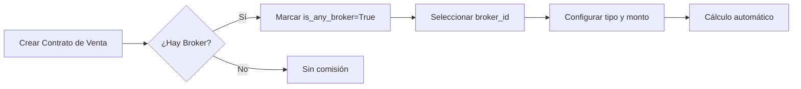

# Sistema de Comisiones - Documentación Técnica

## Resumen

El sistema actual de comisiones está implementado en el modelo `property.vendor` (archivo: `sale_contract.py`) y permite gestionar comisiones para intermediarios (brokers) en contratos de venta de propiedades.

## Modelo: property.vendor

### Campos de Comisiones

| Campo | Tipo | Descripción |
|-------|------|-------------|
| `is_any_broker` | Boolean | Indica si hay un broker involucrado en la venta |
| `broker_id` | Many2one | Referencia al broker (res.partner con user_type='broker') |
| `commission_type` | Selection | Tipo de comisión: 'f' (Fija) o 'p' (Porcentaje) |
| `broker_commission` | Monetary | Monto fijo de comisión |
| `broker_commission_percentage` | Float | Porcentaje de comisión sobre el precio de venta |
| `broker_final_commission` | Monetary | **Computado** - Comisión final calculada |
| `commission_from` | Selection | De quién cobra: 'customer' (Cliente) o 'landlord' (Propietario) |

### Cálculo de Comisiones

```python
def _compute_broker_final_commission(self):
    for rec in self:
        if rec.is_any_broker:
            if rec.commission_type == 'p':
                # Comisión por porcentaje
                rec.broker_final_commission = rec.sale_price * rec.broker_commission_percentage / 100
            else:
                # Comisión fija
                rec.broker_final_commission = rec.broker_commission
        else:
            rec.broker_final_commission = 0.0
```

### Facturación de Comisiones

El sistema genera facturas automáticas para brokers:
- **Campo**: `broker_bill_id` - Factura del broker
- **Campo**: `broker_invoice_id` - Otra factura relacionada
- **Estados**: `broker_bill_payment_state`, `broker_invoice_payment_state`

## Flujo de Comisiones

### 1. Registro de Venta


### 2. Tipos de Comisión

#### Comisión Fija
- Usuario establece monto en `broker_commission`
- Ejemplo: RD$50,000 fijos

#### Comisión por Porcentaje
- Usuario establece `broker_commission_percentage`
- Se calcula sobre `sale_price`
- Ejemplo: 3% de RD$1,000,000 = RD$30,000

### 3. Fuente de Pago

La comisión puede ser pagada por:
- **Cliente** (`commission_from='customer'`): Se incluye en factura al cliente
- **Propietario** (`commission_from='landlord'`): Se descuenta del ingreso

## Integración con res.partner

Los brokers son partners con `user_type = 'broker'`:
```python
broker_id = fields.Many2one('res.partner', string='Broker', domain=[('user_type', '=', 'broker')])
```

## Propuesta para Vendedores Externos/Asesores

### Opción 1: Extender Sistema Actual (Recomendado)

Agregar un campo booleano para diferenciar tipos de broker:

```python
# En res.partner
is_external_advisor = fields.Boolean(
    string='Asesor Externo',
    help='Marca este contacto como asesor externo (no empleado)'
)

# En property.vendor - filtrar por tipo
external_advisor = fields.Boolean(
    related='broker_id.is_external_advisor',
    string='Es Asesor Externo',
    store=True
)
```

**Ventajas:**
- Reutiliza todo el código existente
- No duplica lógica
- Fácil de implementar

### Opción 2: Campo Separado para Asesores

Crear campos completamente nuevos:

```python
advisor_id = fields.Many2one('res.partner', string='Asesor')
advisor_commission = fields.Monetary(string='Comisión Asesor')
# ... duplicar lógica de broker
```

**Desventajas:**
- Duplicación de código
- Más mantenimiento
- Más complejo

## Reportes y Análisis

### Comisiones por Broker
```python
# Búsqueda SQL directa
self.env.cr.execute("""
    SELECT 
        broker_id,
        SUM(broker_final_commission) as total_commissions,
        COUNT(*) as sales_count
    FROM property_vendor
    WHERE is_any_broker = true
    GROUP BY broker_id
""")
```

### Smart Button en res.partner
```python
property_sold_ids = fields.One2many(
    'property.vendor', 
    'broker_id', 
    string="Sold Commission"
)
```

## Configuración del Sistema

### Productos para Facturación
- **Producto de Reserva**: `property_product_2` (Booking)
- **Producto de Comisión**: `property_product_3` (Broker Commission)
- **Producto de Cuota**: `property_product_1` (Installment)

Los productos se configuran en:
```xml
<!-- Archivo: ir_config_parameter -->
cjg_finance_property.broker_item_id
```

## Consideraciones de Seguridad

- Los brokers deben tener `user_type='broker'` en `res.partner`
- El acceso a comisiones debe estar controlado por grupos
- Las facturas de comisiones deben estar auditables

## Próximos Pasos Sugeridos

1. **Clarificar requisitos de asesores externos**:
   - ¿Necesitan acceso al sistema?
   - ¿Comisiones calculadas igual que brokers?
   - ¿Reportes separados?

2. **Implementar según Opción 1**:
   - Agregar campo `is_external_advisor` a `res.partner`
   - Crear vista filtrada para asesores externos
   - Agregar reportes específicos

3. **Testing**:
   - Crear casos de prueba para ambos tipos
   - Validar cálculos de comisión
   - Verificar facturación correcta
